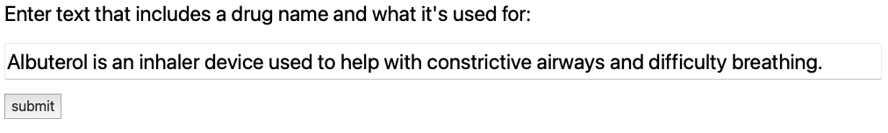
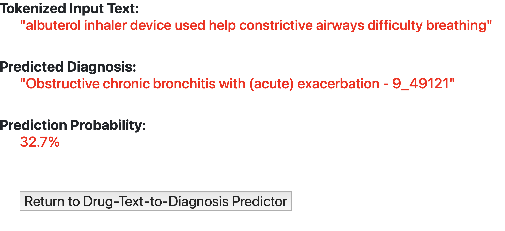

# Medical Diagnosis Prediction from Drug Information

This project involved taking unstructured text about drugs and using NLP tools to predict medical diagnoses with that text. The full report writeup can be found at [`report_writeup/report.pdf`](report_writeup/report.pdf)

The best model from the result of this project work is saved into `model_artifacts/logistic_m1.pickle`. 

## REST Service App:

To run the Flask app:
- Clone this repository
- Create a virtual environment using `requirements.txt`
- Activate the virtual environment
- Open a terminal window in the root directory, and then run this command:
```
python api.py
```

If you click the link to http://127.0.0.1:5000/, you will be prompted with a screen allowing you to enter text. 
For example, you could enter text about Albuterol and its indications:



If you then hit "submit", it will return a response on the second page like the following:



After which you can hit the `Return to Drug-Text-to-Diagnosis Predictor` button. 
This will return you to the main homepage.
